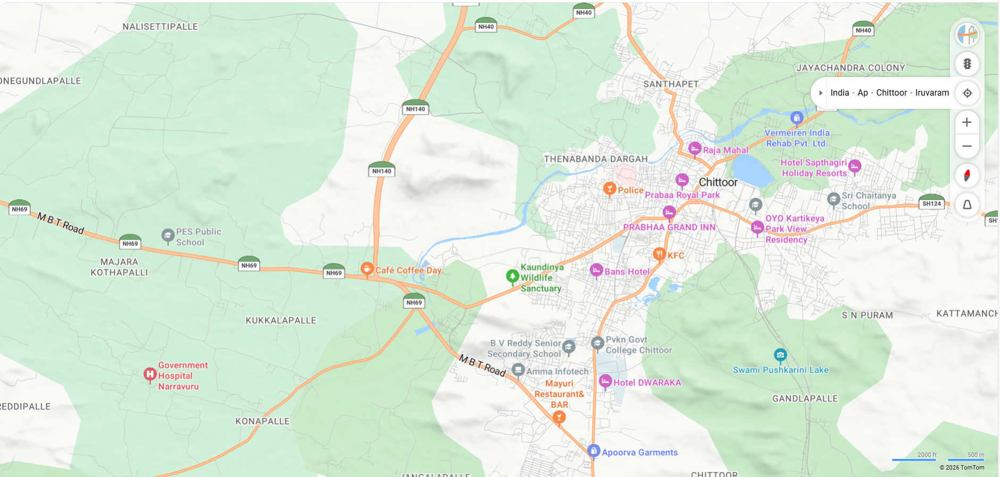
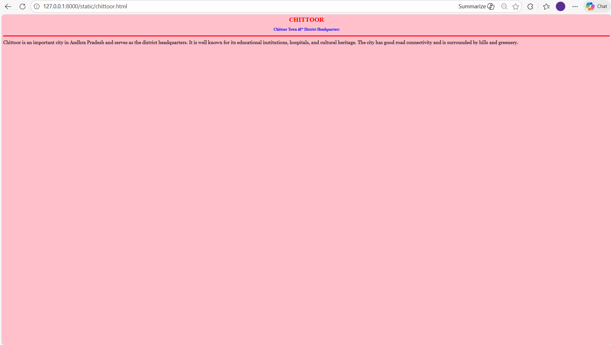
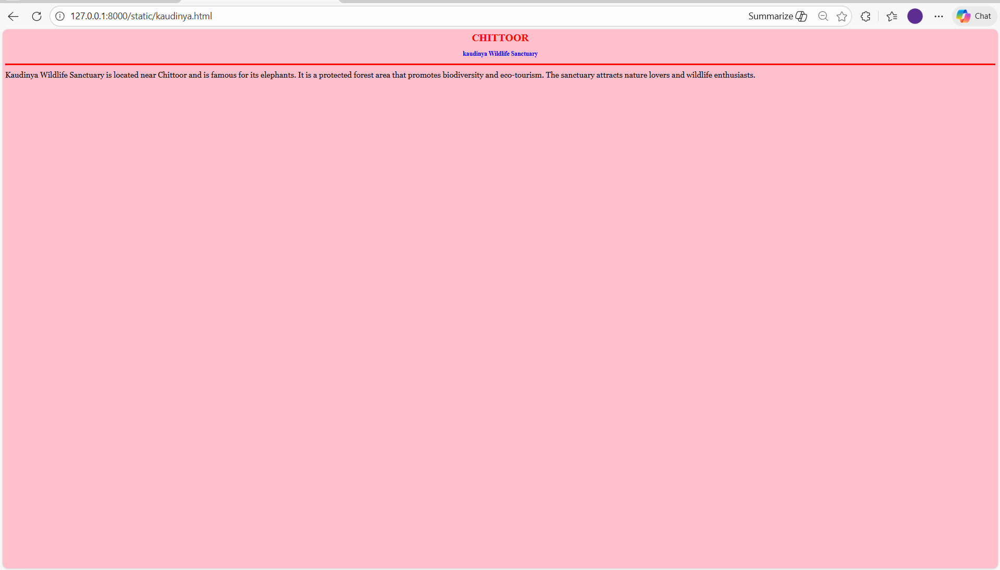
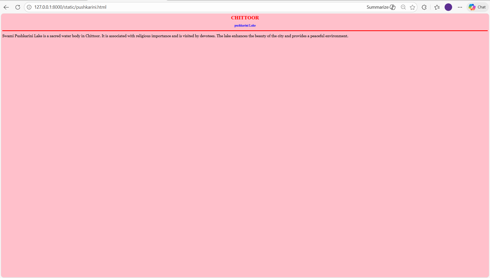
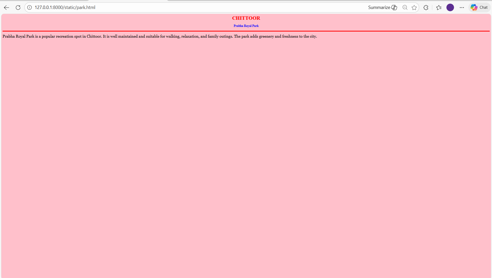
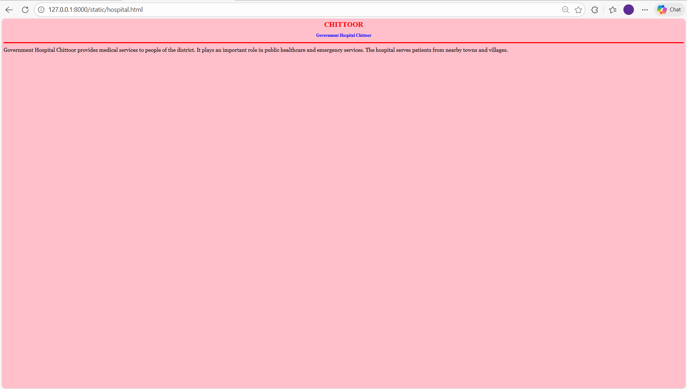

# Ex03 Places Around Me
## Date: 15-02-2026

## AIM
To develop a website to display details about the places around my house.

## DESIGN STEPS

### STEP 1
Create a Django admin interface.

### STEP 2
Download your city map from Google.

### STEP 3
Using ```<map>``` tag name the map.

### STEP 4
Create clickable regions in the image using ```<area>``` tag.

### STEP 5
Write HTML programs for all the regions identified.

### STEP 6
Execute the programs and publish them.

## CODE
```
map.html

<!DOCTYPE html>
<html>
<head>
    <title>My City - Chittoor Map</title>
</head>

<body>

    <h1 align="center">
        <font color="red"><b>CHITTOOR</b></font>
    </h1>

    <h3 align="center">
        <font color="blue"><b>Susmitha (24010204)</b></font>
    </h3>

    <center>

        

        <map name="MyCity">

            <area shape="rect"
                  coords="1311,327,1419,359"
                  href="chittoor.html"
                  title="Chittoor Town">

            <area shape="circle"
                  coords="1019,520,63"
                  href="kaudinya.html"
                  title="Kaudinya Wildlife Sanctuary">

            <area shape="circle"
                  coords="1441,666,204"
                  href="pushkarini.html"
                  title="Swami Pushkarini Lake">

            <area shape="circle"
                  coords="1256,363,143"
                  href="park.html"
                  title="Prabha Royal Park">

            <area shape="rect"
                  coords="430,748,269,668"
                  href="hospital.html"
                  title="Government Hospital Chittoor">

        </map>

    </center>

</body>
</html>

chittoor.html

<html>
<head>
<title>Chittoor Town</title>
</head>

<body bgcolor="pink">

<h1 align="center">
<font color="red"><b>CHITTOOR</b></font>
</h1>

<h3 align="center">
<font color="blue"><b>Chittoor Town – District Headquarters</b></font>
</h3>

<hr size="3" color="red">

<p align="justify">
<font face="Georgia" size="5">
Chittoor is an important city in Andhra Pradesh and serves as the district headquarters.
It is well known for its educational institutions, hospitals, and cultural heritage.
The city has good road connectivity and is surrounded by hills and greenery.
</font>
</p>

</body>
</html>

kaudinya.html

<html>
<head>
<title>Kaudinya Wildlife Sanctuary</title>
</head>

<body bgcolor="pink">

<h1 align="center">
<font color="red"><b>CHITTOOR</b></font>
</h1>

<h3 align="center">
<font color="blue"><b>kaudinya Wildlife Sanctuary</b></font>
</h3>

<hr size="3" color="red">

<p align="justify">
<font face="Georgia" size="5">
Kaudinya Wildlife Sanctuary is located near Chittoor and is famous for its elephants.
It is a protected forest area that promotes biodiversity and eco-tourism.
The sanctuary attracts nature lovers and wildlife enthusiasts.
</font>
</p>

</body>
</html>

pushkarini.html

<html>
<head>
<title>Swami Pushkarini Lake</title>
</head>

<body bgcolor="pink">

<h1 align="center">
<font color="red"><b>CHITTOOR</b></font>
</h1>

<h3 align="center">
<font color="blue"><b>pushkarini Lake</b></font>
</h3>

<hr size="3" color="red">

<p align="justify">
<font face="Georgia" size="5">
Swami Pushkarini Lake is a sacred water body in Chittoor.
It is associated with religious importance and is visited by devotees.
The lake enhances the beauty of the city and provides a peaceful environment.
</font>
</p>

</body>
</html>

park.html

<html>
<head>
<title>Prabha Royal Park</title>
</head>

<body bgcolor="pink">

<h1 align="center">
<font color="red"><b>CHITTOOR</b></font>
</h1>

<h3 align="center">
<font color="blue"><b>Prabha Royal Park</b></font>
</h3>

<hr size="3" color="red">

<p align="justify">
<font face="Georgia" size="5">
Prabha Royal Park is a popular recreation spot in Chittoor.
It is well maintained and suitable for walking, relaxation, and family outings.
The park adds greenery and freshness to the city.
</font>
</p>

</body>
</html>

hospital.html

<html>
<head>
<title>Government Hospital Chittoor</title>
</head>

<body bgcolor="pink">

<h1 align="center">
<font color="red"><b>CHITTOOR</b></font>
</h1>

<h3 align="center">
<font color="blue"><b>Government Hospital Chittoor</b></font>
</h3>

<hr size="3" color="red">

<p align="justify">
<font face="Georgia" size="5">
Government Hospital Chittoor provides medical services to people of the district.
It plays an important role in public healthcare and emergency services.
The hospital serves patients from nearby towns and villages.
</font>
</p>

</body>
</html>
```

## OUTPUT







## RESULT
The program for implementing image maps using HTML is executed successfully.
